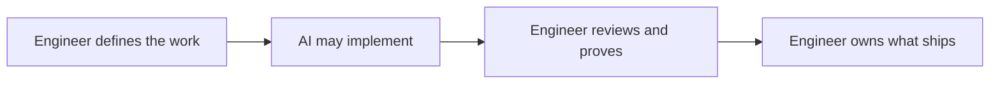

  

  Technical assessments for engineering candidates at <a href="https://github.com/holly-revamp">Holly</a>.

  
  
  

## Our interview process

Our engineering interviews combine structured conversations with work that resembles the job. The
same core sequence applies to all engineering roles and only the technical content changes with the
role.

### Our interview philosophy

AI has changed how engineers build software. It has not replaced engineering fundamentals or the
judgment required to ship software people can trust.

> **TL;DR: The engineer is still the engineer, and that means you. AI may write the code, but you
> drive AI, not the other way around. You define the work, review the output, prove it works, and own
> what ships.**

Writing code is getting cheaper. Deciding what to build and determining whether the result is safe,
correct, and useful are not. That is why our interviews focus on how you frame the problem and
review the output, not how quickly you can produce code.

Our technical interviews measure four things:

- **Independent judgment:** Can you reason about a system, find risk, and make technical decisions
  without outsourcing the thinking to AI?
- **Communication:** Can you explain assumptions and tradeoffs, ask for missing context, and help
  other engineers make better decisions?
- **AI fluency:** Can you give an agent useful context, choose the right work to delegate, and
  inspect its output instead of accepting it blindly?
- **Delivery:** Can you reduce ambiguity, choose a useful scope, and move a real codebase toward a
  requirement?

We do not use LeetCode or abstract puzzles. Every technical prompt comes from a system Holly has
already built in some form. That gives us a concrete basis for the discussion and gives you a fair
picture of the work you would do here.

### What you can expect from us

The goal is to see your best work, not how you respond to artificial pressure. We tell you the
format, timing, tooling policy, and environment requirements in advance. During the interview:

- Ask questions and state assumptions. Ambiguity is part of engineering. Guessing what answer we
  want is not.
- Think out loud when it helps. We care more about your decisions than typing speed, memorized
  syntax, or a beautiful architecture diagram.
- Treat the interviewer as a collaborator. We will answer domain questions, clarify requirements,
  and help with environment problems.
- Change direction when new information warrants it. Recognizing a bad path is a positive signal.
- Do not optimize for finishing everything. A sound, tested slice with clear next steps is better
  than a rushed implementation you cannot defend.

If you need an accommodation or the provided environment does not work on your hardware, tell us.
We will adjust it. Setup friction, accessibility needs, and the computer you own are not part of the
evaluation. If you join Holly, a shiny new work laptop will be waiting on your first day!

The whole process is reciprocal. Every conversation includes time for your questions because you
are evaluating Holly, the role, and the people you would work with too.

### Screen

| Stage | Length | What happens | What we measure |
| --- | ---: | --- | --- |
| Phone screen | 15 minutes | A focused conversation about the role, your background, and logistics. | Mutual fit and whether the role matches what you want to do next. |
| Architectural assessment | 45 minutes | Design a role-specific system, state assumptions, and reason through tradeoffs. | System decomposition, technical depth, failure-mode thinking, and how you navigate ambiguity. |
| Coding assessment | 75 minutes | Review a realistic pull request, then implement a focused feature in a private GitHub repository. | Code-review judgment, AI fluency, delivery, and communication while working. |

We put both technical assessments before the onsite because we respect your time. We want to confirm
the role is a strong technical match before asking you to invest another three hours with the team.
Once you reach the onsite, the focus widens from proving technical fit to understanding how we would
work together. It is also your best opportunity to interview us.

### Onsite

| Stage | Length | What happens | What we measure |
| --- | ---: | --- | --- |
| Hiring manager | 15 minutes | Reconnect on the role, scope, and open questions. | Ownership, impact, and whether expectations are clear on both sides. |
| Technical | 45 minutes | Work through technical decisions with two Holly engineers. | Depth in your domain, engineering judgment, and collaboration with peers. |
| Values | 45 minutes | Discuss how you work and handle the realities of an early-stage team. | How your working style maps to Holly's operating principles. |
| Product | 45 minutes | Connect engineering decisions to customer problems and product outcomes. | Product judgment, customer empathy, and prioritization. |
| Founders meet and greet | 30 minutes | Meet Holly's founders and ask the questions you need to evaluate us. | Mutual fit and space for the questions that matter to you. |

## Engineering assessments

We use two small faux applications (Smally & Dally) to keep the assessment close to day-to-day engineering at Holly.
Candidates receive access to one private repository based on the role.

### Prerequisites

Have these ready before the coding assessment:

| Tool | Version | Notes |
| --- | --- | --- |
| [Node.js](https://nodejs.org/en/download) | 26 | JavaScript runtime used by both assessment repositories. |
| [pnpm](https://pnpm.io/installation) | 11 | Package manager for the monorepo. |
| [Docker Desktop](https://www.docker.com/products/docker-desktop/) | Latest | Runs PostgreSQL, object storage, workers, and the local model through Docker Compose. |
| [Git](https://git-scm.com/downloads) | Latest | Used to work with the private assessment repository. |
| [GitHub account](https://github.com/signup) | Any | We grant your account access before the interview. |

The local model is designed for an Apple Silicon Mac with an **M2 or newer** and at least **24 GB of
memory**. If your machine differs, tell your recruiting contact before the assessment. We will
adjust the environment.

The first startup downloads a roughly 1.28 GB model. Docker caches it for later runs. The private
repository includes the full setup process, seeded data where needed, the task prompt, and the same
`pnpm validate` command used by CI.

### What to expect

We share the repository roughly **one hour before the call** so you can clone it, start the local
services, and get your bearings.

The assessment has two working sessions with different AI policies. Reviewing without AI isolates
your engineering judgment. Building with AI shows how you direct the tools, validate their work,
and remain accountable for what ships.

1. **Code review (~20 min):** Review a small pull request in GitHub as you would at work.
   Look for correctness issues, bugs, security and data-boundary problems, maintainability concerns,
   and places where the implementation misses its requirements. **NO AI** is allowed in this
   portion. We want to see your judgment as the human guardrail for AI-generated code.
2. **Feature implementation (~30 min):** Build a small feature from a written prompt. Use
   whatever AI and development tools you normally use. We reserve an additional **15-minute
   buffer** for setup, discussion, or more implementation time if you need it.

The pull request and feature are modeled after ordinary product and platform work. A complete
production system is not the expectation.

Expand the relevant sections below for the stack and the kinds of problems you will encounter.

<strong>Smally (Product engineering)</strong>

**Smally** (Small + Holly) is a focused class-specification editor and the assessment environment
for product engineering roles. It covers the full path from a PostgreSQL data model to an
AI-assisted React interface.

| Area | Technology |
| --- | --- |
| Language and runtime | TypeScript, Node.js 26 |
| Application | React 19, TanStack Start, TanStack Router, Vite |
| Editor | Tiptap |
| Authentication | Better Auth |
| Data | PostgreSQL 18, Drizzle ORM |
| AI | Vercel AI SDK, a local Qwen model served by llama.cpp |
| UI | Tailwind CSS, shadcn/ui |
| Monorepo and quality | pnpm, Turborepo, tsgo, oxlint, oxfmt |

The Smally review spans a small end-to-end product change across the React application, server
functions, database schema, and shared UI. Expect to trace data through those layers, check auth and
ownership boundaries, and decide whether the implementation and validation support its claims. The
feature portion asks you to extend the same application without rewriting its foundations.

<strong>Dally (Data & AI engineering)</strong>

**Dally** (Data + Holly) is a local data-platform environment and the assessment for Data & AI
engineering roles. It scrapes public classification pages, preserves source artifacts, and exposes
job state through an operations console.

| Area | Technology |
| --- | --- |
| Language and runtime | TypeScript, Node.js 26 |
| API | Hono, Zod contracts and validation |
| Operations console | React 19, Vite, Tailwind CSS, shadcn/ui |
| Ingestion | Cheerio scraper worker |
| Workflows | Hatchet workers and durable tasks |
| Data | PostgreSQL 18, Drizzle ORM |
| Object storage | MinIO through the S3-compatible AWS SDK client |
| AI | A local Qwen model served by llama.cpp |
| Monorepo and quality | pnpm, Turborepo, tsgo, oxlint, oxfmt |

Expect to reason about untrusted inputs, schema validation, idempotency, retries, artifacts, and
failure modes. We care about traceable results and deterministic tests for model-backed behavior.

